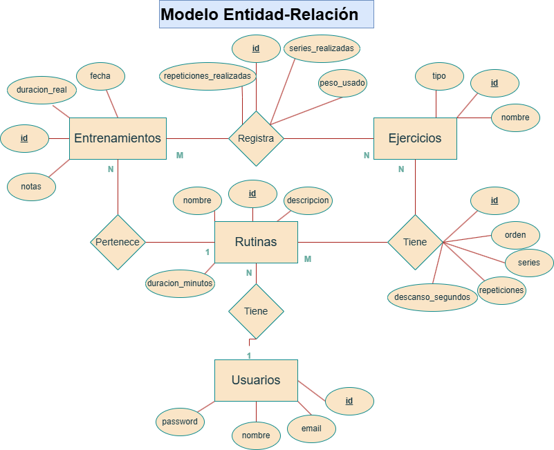

# Diagrama del Modelo Entidad Relacional 

  

---
## Entidades y atributos:
Son 4 las entidades:
- Ejercicios, Representa un ejercicio físico disponible en el sistema (ej, sentadilla, pull ups, peso muerto). Tiene id (PK), nombre y tipo (fuerza, cardio)
- Rutinas, Agrupan ejercicios con un orden, cantidad de series, repeticiones y descanso. Tiene nombre, descripción y duración estimada (los ejercicios se asocian por la tabla intermedia "Rutina_ejercicios"). Su PK es el id.
- Entrenamientos, Almacena datos de entrenamientos ya realizados, como la fecha, duración real y notas. Su PK es el id y posee una FK (rutina_id) que tiene implementado un RESTRICT que hace que no se borre una rutina si tiene entrenamientos asociados.
- Usuarios, Representa a las personas que van a utilizar el sistema. Tiene id (PK), nombre, email y contraseña.

Hay 2 "entidades intermedias" o enidades relacionales, que surgen de las distintas relaciónes:
- Rutina_ejercicios, Surge de la relacion muchos a muchos (M:N) de *rutinas* y *ejercicios*. Almacena atributos propios de la relación, como el orden del ejercicio, número series y repeticiones, descanso. Su Primary Key es el id y posee dos Foreing Key (rutina_id y ejercicio_id, que son las PK de las entidades de la relación)
- Entrenamiento_ejercicio, Surge de la relación muchos a muchos de *entrenamientos* y *ejercicios*. Registra los datos de los entrenamientos ya realizados, cuántas series/repeticiones se hicieron y que peso se utilizó. Su PK es su id y tiene dos FK de la relación (entrenamiento_id y ejercicio_id)

---
## Relaciones: 
Hay cuatro relaciones distintas en este modelo ER:
1. Rutinas - Ejercicios, relación muchos a muchos (M:N). Una rutina contiene muchos ejercicios. Un ejercicio aparece en muchas rutinas.

2. Entrenamientos - Ejercicios, relación muchos a muchos (M:N). Un entrenamiento registra muchos ejercicios. Un ejercicio se registra en muchos entrenamientos.

3. Rutinas - Entrenamientos, relación uno a muchos (1:N). Una rutina puede tener muchos entrenamientos asociados, pero un entrenamiento pertenece a una sola rutina.

4. Rutinas - Usuarios, relación uno a muchos (1:N). Un usuario tiene muchas rutinas, y cada rutina pertenece a un solo usuario.
